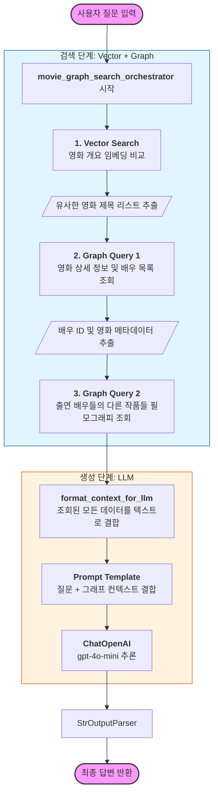

# 로직처리 구성도
```
미리보기 화면은 Ctrl+shift+V 누르시오
```

```mermaid

graph TD
    %% 1. 시작 및 입력
    Start([사용자 질문 입력]) --> Orchestrator[<b>movie_graph_search_orchestrator</b> 시작]

    subgraph Retrieval_Phase [검색 단계: Vector + Graph]
        %% 2. 벡터 검색
        Orchestrator --> VecSearch[<b>1. Vector Search</b><br/>영화 개요 임베딩 비교]
        VecSearch --> FoundTitles[/유사한 영화 제목 리스트 추출/]

        %% 3. 그래프 검색 (1단계)
        FoundTitles --> GraphSearch1[<b>2. Graph Query 1</b><br/>영화 상세 정보 및 배우 목록 조회]
        GraphSearch1 --> ActorIDs[/배우 ID 및 영화 메타데이터 추출/]

        %% 4. 그래프 검색 (2단계)
        ActorIDs --> GraphSearch2[<b>3. Graph Query 2</b><br/>출연 배우들의 다른 작품들 필모그래피 조회]
    end

    %% 5. 컨텍스트 구성
    GraphSearch2 --> Formatter[<b>format_context_for_llm</b><br/>조회된 모든 데이터를 텍스트로 결합]
    
    subgraph Generation_Phase [생성 단계: LLM]
        %% 6. 프롬프트 및 LLM
        Formatter --> PromptBuilder[<b>Prompt Template</b><br/>질문 + 그래프 컨텍스트 결합]
        PromptBuilder --> LLM[<b>ChatOpenAI</b><br/>gpt-4o-mini 추론]
    end

    %% 7. 결과 출력
    LLM --> Parser[StrOutputParser]
    Parser --> End([최종 답변 반환])

    %% 스타일링
    style Start fill:#f9f,stroke:#333,stroke-width:2px
    style End fill:#f9f,stroke:#333,stroke-width:2px
    style Retrieval_Phase fill:#e1f5fe,stroke:#01579b
    style Generation_Phase fill:#fff3e0,stroke:#e65100
```

